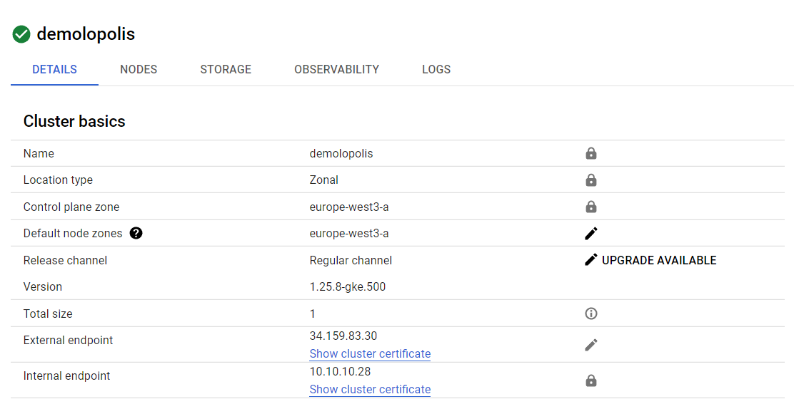
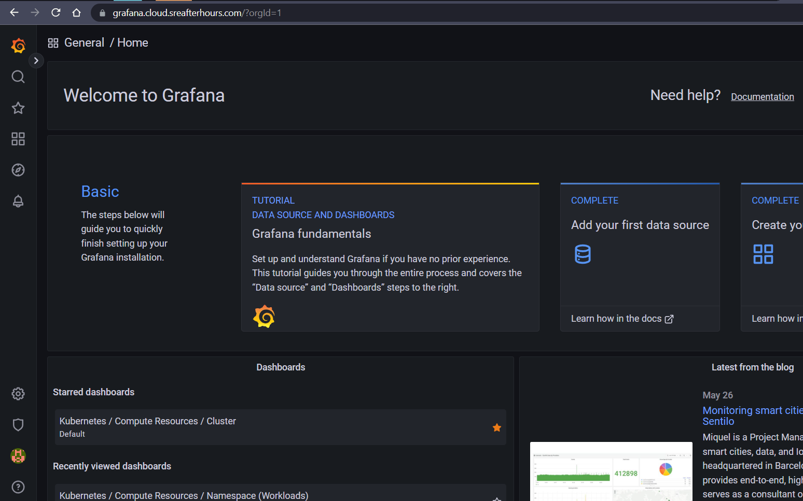
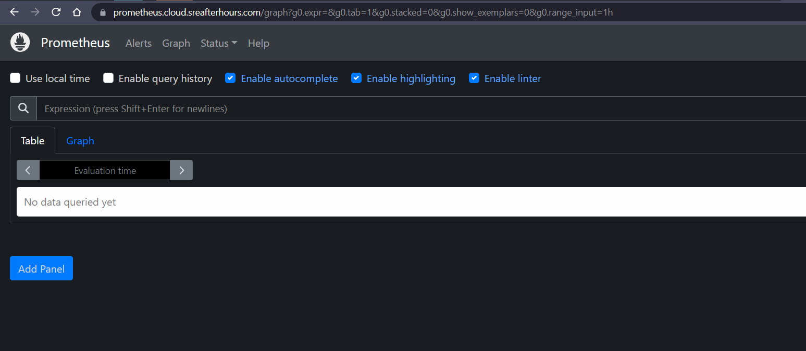
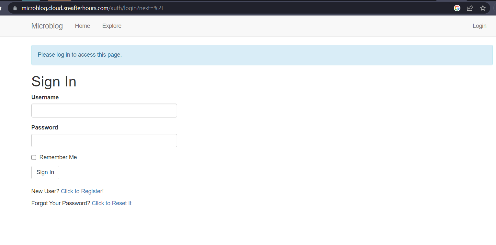

I have been playing around with Kubernetes and Google Kubernetes Engine lately, and I figured why not share some of my notes on my blog. With that, in this post, I documented how I set up a [GKE](https://cloud.google.com/kubernetes-engine) cluster, installed some useful tools and automations, and then deployed a demo application called "microblog".

## Prerequisites

Install gcloud and kubectl for your distro, then configure gcloud:

```bash
export PROJECT_ID=
gcloud auth login
gcloud config set project $PROJECT_ID
```

I am using my subdomain `cloud.sreafterhours.com` in this documentation, which is delegated to [Cloud DNS](https://cloud.google.com/dns):


## Certificate management

I prefer automating certificate management for relatively-small projects. This saves a lot of management overhead, and allows users (i.e. developers) to freely use certificates on the ingresses they deploy.

In this exercise, I am using [cert-manager](https://cert-manager.io/docs/) and [Let's Encrypt](https://letsencrypt.org/) ACME issuer.

### DNS challenge

When creating a certificate signing request, you typically have to prove ownership to the domain(s) you are creating a certificate for. There are a few ways to resolve the challenge for verifying domain ownership, but considering that I use Cloud DNS for the domains anyway, I would just use [Cloud DNS challenge](https://cert-manager.io/docs/configuration/acme/dns01/google/).

Create a service account that will be used by cert-manager to solve the DNS challenge:

```bash
gcloud iam service-accounts create sa-dns01-solver --display-name "Kubernetes cert-manager DNS resolver"

gcloud projects add-iam-policy-binding $PROJECT_ID \
   --member serviceAccount:sa-dns01-solver@$PROJECT_ID.iam.gserviceaccount.com \
   --role roles/dns.admin
```

The above command attaches the `dns.admin` role. Alternatively, you could also create a role with only the following permissions:

- dns.resourceRecordSets.*
- dns.changes.*
- dns.managedZones.list

Generate a key for the service account:

```bash
gcloud iam service-accounts keys create key.json \
  --iam-account sa-dns01-solver@$PROJECT_ID.iam.gserviceaccount.com
```

### cert-manager

Deploy `cert-manager` and verify:

```bash
kubectl apply -f https://github.com/cert-manager/cert-manager/releases/download/v1.8.2/cert-manager.yaml

kubectl -n cert-manager get all
```

Create a Kubernetes secret out of the key. Create it in the `cert-manager` namespace since we are creating a cluster issuer in the next steps:

```bash
kubectl -n cert-manager create secret generic \
  clouddns-dns01-solver-svc-acct --from-file=key.json

# clean up
rm -f ./key.json
```

Create the `ClusterIssuer`, passing information such as administrator's email address, project ID, and the name of the secret containing the service account credentials:

```bash
MY_EMAIL=<email>

cat <<EOF | kubectl apply -f -
apiVersion: cert-manager.io/v1
kind: ClusterIssuer
metadata:
  name: letsencrypt-production
spec:
  acme:
    server: https://acme-v02.api.letsencrypt.org/directory
    email: ${MY_EMAIL}
    privateKeySecretRef:
      name: letsencrypt-production
    solvers:
    - dns01:
        cloudDNS:
          project: ${PROJECT_ID}
          serviceAccountSecretRef:
            name: clouddns-dns01-solver-svc-acct
            key: key.json
EOF
```

Alternatively, you could also use LE's staging server for testing purposes:

```bash
cat <<EOF | kubectl apply -f -
apiVersion: cert-manager.io/v1
kind: ClusterIssuer
metadata:
  name: letsencrypt-staging
spec:
  acme:
    server: https://acme-staging-v02.api.letsencrypt.org/directory
    email: ${MY_EMAIL}
    privateKeySecretRef:
      name: letsencrypt-staging
    solvers:
    - dns01:
        cloudDNS:
          project: ${PROJECT_ID}
          serviceAccountSecretRef:
            name: clouddns-dns01-solver-svc-acct
            key: key.json
```

## Google Kubernetes Engine

Create a small 1-node cluster with machine type `e2-standard-4` (4 vCPUs, 8 GB memory). I am creating it in an existing manual-mode VPC. Also enable [Dataplane v2](https://cloud.google.com/kubernetes-engine/docs/concepts/dataplane-v2), because [eBPF]](https://ebpf.io/what-is-ebpf/) FTW!

```bash
gcloud beta container clusters create demolopolis \
  --zone "europe-west3-a" \
  --network "europe-vpc" --subnetwork "west3" \
  --disk-size "50" \
  --metadata disable-legacy-endpoints=true \
  --num-nodes "1" --machine-type "e2-standard-4" \
  --no-enable-intra-node-visibility \
  --enable-dataplane-v2 \
  --addons HorizontalPodAutoscaling,GcePersistentDiskCsiDriver \
  --workload-pool "${PROJECT_ID}.svc.id.goog"
```

Notice that the `HttpLoadBalancing` addon was not included, because in the next section we will configure [ingress-nginx](https://github.com/kubernetes/ingress-nginx) instead.

Result:



Configure `kubectl`:

```bash
gcloud container clusters get-credentials demolopolis --region europe-west3-a

# verify:
kubectl cluster-info
```

### Ingress controller

Deploy ingress-nginx:

```bash
kubectl apply -f https://raw.githubusercontent.com/kubernetes/ingress-nginx/controller-v1.7.1/deploy/static/provider/cloud/deploy.yaml
kubectl -n ingress-nginx get po
```

### Tools

Deploy `netshoot`, a very handy tool for troubleshooting and verifying connectivity:

```bash
cat <<EOF | kubectl apply -f -
apiVersion: v1
kind: Pod
metadata:
  name: netshoot
  labels:
    app.kubernetes.io/name: netshoot
spec:
  containers:
  - name: netshoot
    image: nicolaka/netshoot
    command: ['sh', '-c', 'while true; do sleep 5; done']
EOF
```

## Monitoring

### Prometheus and Grafana

Prometheus management can get complicated sometimes. I would simplify this by using the Prometheus Operator instead. Here is a cute trick for grabbing the manifests from the GitHub repo while trying not to clutter your local machine:

```bash
mkdir ./work
docker run -it -v ${PWD}/work:/work -w /work alpine sh
apk add git
# clone using http so you don't have to install ssh
git clone --depth 1 https://github.com/prometheus-operator/kube-prometheus.git -b release-0.12 /tmp/
cp -Rp /tmp/manifests .
exit
```

Create the namespace and CRDs. Here we are doing a server-side apply because of some CRD sizes.

```bash
kubectl apply --server-side -f ./work/manifests/setup
```

Deploy the stack:

```bash
# wait for the components to complete to avoid race condition
kubectl wait \
	--for condition=Established \
	--all CustomResourceDefinition \
	--namespace=monitoring

kubectl apply -f ./work/manifests/

# verify:
kubectl -n monitoring get pods
```

Temporarily port-forward to test:

```bash
kubectl -n monitoring port-forward --address 0.0.0.0 svc/grafana 3000:3000
```

Grafana should be available at <http://127.0.0.1:3000>.

The `kube-prometheus` manifests include network policies which will restrict ingress access to pods, so we need to define network policies to allow our ingress controller (and tools) to reach the Prometheus and Grafana pods:

```bash
cat <<EOF | kubectl apply -f -
apiVersion: networking.k8s.io/v1
kind: NetworkPolicy
metadata:
  labels:
    app.kubernetes.io/component: grafana
    app.kubernetes.io/name: grafana
  name: allow-ingress-to-grafana
  namespace: monitoring
spec:
  ingress:
  - from:
    - namespaceSelector:
        matchLabels:
          app.kubernetes.io/name: ingress-nginx
    - namespaceSelector:
        matchLabels:
          kubernetes.io/metadata.name: default
      podSelector:
        matchLabels:
          app.kubernetes.io/name: netshoot
    ports:
    - port: 3000
      protocol: TCP
  podSelector:
    matchLabels:
      app.kubernetes.io/component: grafana
      app.kubernetes.io/name: grafana
      app.kubernetes.io/part-of: kube-prometheus
  policyTypes:
  - Ingress
---
apiVersion: networking.k8s.io/v1
kind: NetworkPolicy
metadata:
  labels:
    app.kubernetes.io/component: prometheus
    app.kubernetes.io/name: prometheus
  name: allow-ingress-to-prometheus
  namespace: monitoring
spec:
  ingress:
  - from:
    - namespaceSelector:
        matchLabels:
          app.kubernetes.io/name: ingress-nginx
    - namespaceSelector:
        matchLabels:
          kubernetes.io/metadata.name: default
      podSelector:
        matchLabels:
          app.kubernetes.io/name: netshoot
    ports:
    - port: 9090
      protocol: TCP
  podSelector:
    matchLabels:
      app.kubernetes.io/component: prometheus
      app.kubernetes.io/instance: k8s
      app.kubernetes.io/name: prometheus
      app.kubernetes.io/part-of: kube-prometheus
  policyTypes:
  - Ingress
EOF
```

Example commands to verify that we properly formatted our ingress rules:

```bash
## verify that the rules have been created properly:
kubectl -n monitoring get networkpolicy allow-ingress-to-grafana -o jsonpath='{.spec.ingress[0].from[0]}' | jq
kubectl -n monitoring get networkpolicy allow-ingress-to-grafana -o jsonpath='{.spec.ingress[0].from[1]}' | jq
````

Test with netshoot:

```bash
kubectl exec -it netshoot -- bash -c 'curl http://grafana.monitoring.svc.cluster.local:3000'
kubectl exec -it netshoot -- bash -c 'curl http://prometheus-k8s.monitoring.svc.cluster.local:9090'
```

Create a single certificate for both Prometheus and Grafana:

```bash
cat <<EOF | kubectl apply -f -
---
apiVersion: cert-manager.io/v1
kind: Certificate
metadata:
  name: monitoring-cloud-sreafterhours-com
  namespace: monitoring
spec:
  secretName: monitoring-tls
  issuerRef:
    name: letsencrypt-production
    kind: ClusterIssuer
  dnsNames:
  - grafana.cloud.sreafterhours.com
  - prometheus.cloud.sreafterhours.com
EOF
```

This would use the first entry as the canonical name, and of course the entries under `dnsNames` would be added as the [cert SAN](https://knowledge.digicert.com/solution/SO9440.html).

Create a single ingress resource for Grafana and Prometheus, and route to corresponding backend using the CNI in the request:

```bash
# get the port names
kubectl -n monitoring get svc grafana -o yaml
kubectl -n monitoring get svc prometheus-k8s -o yaml

MY_IP=$(curl -s ipconfig.io)

cat <<EOF | kubectl apply -f -
apiVersion: networking.k8s.io/v1
kind: Ingress
metadata:
  annotations:
    nginx.ingress.kubernetes.io/whitelist-source-range: ${MY_IP}
  name: monitoring
  namespace: monitoring
spec:
  ingressClassName: nginx
  tls:
    - hosts:
      - grafana.cloud.sreafterhours.com
      - prometheus.cloud.sreafterhours.com
      secretName: monitoring-tls
  rules:
  - host: grafana.cloud.sreafterhours.com
    http:
      paths:
      - backend:
          service:
            name: grafana
            port:
              name: http
        path: /
        pathType: Prefix
  - host: prometheus.cloud.sreafterhours.com
    http:
      paths:
      - backend:
          service:
            name: prometheus-k8s
            port:
              name: web
        path: /
        pathType: Prefix
EOF
```

Create the A records in Cloud DNS:

```bash
# grab the external IP address associated with the LB resource:
EXT_IP=$(kubectl -n monitoring get ing monitoring -o jsonpath='{.status.loadBalancer.ingress[0].ip}')

gcloud dns record-sets create grafana.cloud.sreafterhours.com. \
  --zone="cloud-sreafterhours-com" --type="A" --ttl="300" \
  --rrdatas="${EXT_IP}"
gcloud dns record-sets create prometheus.cloud.sreafterhours.com. \
  --zone="cloud-sreafterhours-com" --type="A" --ttl="300" \
  --rrdatas="${EXT_IP}"
```

Test:

```bash
curl https://grafana.cloud.sreafterhours.com/ -I
curl https://prometheus.cloud.sreafterhours.com/ -I
```

Grafana:



Prometheus:



## Application

### Background

The application is called "microblog" and was used by [Miguel Griberg](https://github.com/miguelgrinberg) in his Flask Mega-Tutorial [blog](https://blog.miguelgrinberg.com/post/the-flask-mega-tutorial-part-i-hello-world). I cloned the repository [here](https://github.com/guerzon/microblog).

### Dockerize the application

Create the Docker Artifact Registry. For this demo, I created:

`europe-west3-docker.pkg.dev/<PROJECT_ID>/demolopolis`

The application already had a `Dockerfile`, but there was an issue with the dependencies and I had opinions on a few things, so I recreated it as follows:

```Dockerfile
FROM python:3.11-slim

WORKDIR /app

COPY requirements.txt requirements.txt
RUN pip install -r requirements.txt
RUN pip install gunicorn pymysql cryptography

COPY app app
COPY migrations migrations
COPY microblog.py config.py boot.sh ./
RUN chmod a+x boot.sh

ENV FLASK_APP microblog.py

EXPOSE 5000
ENTRYPOINT ["./boot.sh"]
```

### GitHub Actions

The following [action](https://github.com/guerzon/microblog/blob/main/.github/workflows/build_push.yaml) builds the image and pushes it to Artifact Registry:

```yaml
name: Release
on: 
  push:
jobs:
  docker-image-release:
    name: Build & push to Google Artifact Registry
    runs-on: ubuntu-latest
    if: github.event_name == 'push' && startsWith(github.ref, 'refs/tags')
    steps:
      - name: Checkout
        id: checkout
        uses: actions/checkout@v3
      - name: Authenticate to Google Cloud
        id: auth
        uses: google-github-actions/auth@v0
        with:
          token_format: access_token
          credentials_json: '${{ secrets.B64_GCLOUD_SERVICE_ACCOUNT_JSON }}'
      - name: Login to the registry
        uses: docker/login-action@v1
        with:
          registry: europe-west3-docker.pkg.dev
          username: oauth2accesstoken
          password: '${{ steps.auth.outputs.access_token }}'
      - name: Get image tag
        id: get-image-tag
        run: echo ::set-output name=short_ref::${GITHUB_REF#refs/*/}
      - name: Build and push the image
        id: build-tag-push
        uses: docker/build-push-action@v2
        with:
          push: true
          tags: |
            europe-west3-docker.pkg.dev/<PROJECT_ID>/demolopolis/microblog:${{ steps.get-image-tag.outputs.short_ref }}
            europe-west3-docker.pkg.dev/<PROJECT_ID>/demolopolis/microblog:latest
```

The flow is very simple - build using tags, authenticate to Google Cloud, login to the registry, extract the git tag, then build and push the image with the corresponding tag and additionally the `latest` tag.

### Deployment

The following command creates a namespace, a certificate, a deployment with 1 replica, a service, and an nginx ingress resource.

```bash
cat <<EOF | kubectl apply -f -
apiVersion: v1
kind: Namespace
metadata:
  labels:
    app.kubernetes.io/instance: microblog
    app.kubernetes.io/name: microblog
    kubernetes.io/metadata.name: microblog
  name: microblog
---
apiVersion: cert-manager.io/v1
kind: Certificate
metadata:
  name: microblog-cloud-sreafterhours-com
  namespace: microblog
spec:
  secretName: microblog-tls
  issuerRef:
    name: letsencrypt-production
    kind: ClusterIssuer
  dnsNames:
  - microblog.cloud.sreafterhours.com
---
apiVersion: apps/v1
kind: Deployment
metadata:
  labels:
    app: microblog
  name: microblog
  namespace: microblog
spec:
  replicas: 1
  selector:
    matchLabels:
      app: microblog
  template:
    metadata:
      labels:
        app: microblog
    spec:
      containers:
      - image: europe-west3-docker.pkg.dev/<PROJECT_ID>/demolopolis/microblog:1.0
        name: microblog
        ports:
        - containerPort: 5000
        resources:
          requests:
            cpu: "250m"
            memory: "100Mi"
          limits:
            cpu: "500m"
            memory: "500Mi"
---
apiVersion: v1
kind: Service
metadata:
  labels:
    app: microblog
  name: microblog
  namespace: microblog
spec:
  ports:
  - name: microblogport
    port: 80
    protocol: TCP
    targetPort: 5000
  selector:
    app: microblog
  type: ClusterIP
---
apiVersion: networking.k8s.io/v1
kind: Ingress
metadata:
  annotations:
    nginx.ingress.kubernetes.io/whitelist-source-range: ${MY_IP}
  name: microblog
  namespace: microblog
spec:
  ingressClassName: nginx
  tls:
    - hosts:
      - microblog.cloud.sreafterhours.com
      secretName: microblog-tls
  rules:
  - host: microblog.cloud.sreafterhours.com
    http:
      paths:
      - backend:
          service:
            name: microblog
            port:
              name: microblogport
        path: /
        pathType: Prefix
EOF
```

You might have noticed that the ingress resources were annotated to allow only our public IP address. This is a quick and easy-to-add layer of security to our application while testing. A user coming from another source IP address would get a `403 Forbidden` error:

Wait for the certificate to be signed and the Load-Balancer to allocate a public IP address:

```bash
kubectl -n microblog get cert,ing
```

Create the A record in Cloud DNS:

```bash
# grab the external IP address associated with the LB resource:
EXT_IP=$(kubectl -n microblog get ing microblog -o jsonpath='{.status.loadBalancer.ingress[0].ip}')

gcloud dns record-sets create microblog.cloud.sreafterhours.com. \
  --zone="cloud-sreafterhours-com" --type="A" --ttl="300" \
  --rrdatas="${EXT_IP}"
```

Application is now available at <https://microblog.cloud.sreafterhours.com>.



## Cleanup

```bash
gcloud dns record-sets delete grafana.cloud.sreafterhours.com. --zone="cloud-sreafterhours-com" --type="A"
gcloud dns record-sets delete prometheus.cloud.sreafterhours.com. --zone="cloud-sreafterhours-com" --type="A"
gcloud dns record-sets delete microblog.cloud.sreafterhours.com. --zone="cloud-sreafterhours-com" --type="A"
gcloud container clusters delete demolopolis --region europe-west3-a
gcloud projects remove-iam-policy-binding $PROJECT_ID \
   --member serviceAccount:sa-dns01-solver@$PROJECT_ID.iam.gserviceaccount.com \
   --role roles/dns.admin
gcloud iam service-accounts delete sa-dns01-solver@$PROJECT_ID.iam.gserviceaccount.com
```

## Next steps:

1. I want to get rid of the YAMLs for deploying the application and use ArgoCD instead.
2. Running multiple replicas. Firstly, I need to figure out how the application would support this properly.
3. Automate Cloud DNS provisioning.
4. Use [GKE Ingress][https://cloud.google.com/kubernetes-engine/docs/concepts/ingress) for external LB and compare it with third-party ingress controllers such as ingress-nginx.

Thanks for reading!